---
title       : Plots in R
subtitle    : ggplot2 plotting system
author      : Víctor Granda
job         : Technician at CREAF
logo        : logo.png
framework   : io2012        # {io2012, html5slides, shower, dzslides, ...}
highlighter : highlight.js  # {highlight.js, prettify, highlight}
hitheme     : solarized_dark_custom     # 
widgets     : [mathjax, quiz, bootstrap]            # {mathjax, quiz, bootstrap}
mode        : selfcontained # {standalone, draft}
knit        : slidify::knit2slides
--- .quote bg:#90C695

  <q> Intro </q>

--- .normal &threexthree w1:45% w2:5% w3:45% h1:90% h2:5% h3:5%

## Data

**R** comes with example data sets, allowing us to use them to get confidence
with the different analyses and functions we can perform. If you want to see
all the data sets installed and a brief description type
`library(help = "datasets")` in the console.  
Today we will be using the `iris` data set. It was collected by Edgar Anderson in
1935, measuring the sepal and petal length and width of 50 *Iris* flowers of
3 different species (*I. setosa*, *I. versicolor*, *I. virginica*).  

More info about the data:  
- *Anderson, E (1935). The irises of the Gaspe Peninsula, Bulletin of the American Iris Society, 59, 2–5*.  
- *Fisher, R. A. (1936) The use of multiple measurements in taxonomic problems. Annals of Eugenics, 7, Part II, 179–188*.


```r
# See the data
iris
```

*** =pnotes


Image from [http://sebastianraschka.com/](http://sebastianraschka.com/)

--- .normal &threexthree w1:33.33% w2:33.33% w3:33.33% h1:90% h2:5% h3:5% bg:#90C695

## Plots in **R**  

**R** not only allows for diverse analyses (a lot really!), but also implements
a powerful graphic motor:

***=left1


*** =center1


*** =right1
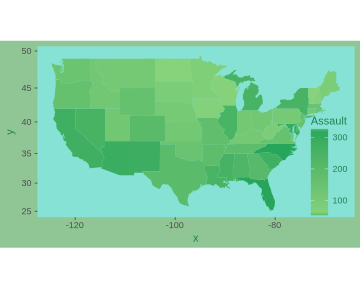

--- .normal

## Plots in **R**
### Plot systems in **R**

1. *base*  

2. *lattice*  

3. *ggplot2*

--- .normal

## Plots in **R**
### 1. *base*

* Empty "canvas"
  + First a high level function (`plot()`, `hist()`...)
  + Add annotations (lines, text...) using low level functions (`text()`, `title()`,
    `abline()`...)
* Previous planning
  + There is no *undo*
  + This has its importance when building complex graphs
* Difficulty to follow up by others
* **TLDR: A concatenation of functions**

--- .code &twocolvariable w1:55% w2:45%

## Plots in **R**
### 1. *base*

*** =left


```r
# Build the plot
plot(Petal.Width ~ Petal.Length, data = iris)

# a model to get the ab line
model.1 <- lm(Petal.Width ~ Petal.Length,
              data = iris)
abline(model.1)

# Add equation as text
intercept <- round(model.1$coefficients['(Intercept)'],3)
slope <- round(model.1$coefficients['Petal.Length'],3)
mtext(paste('y = ', slope, 'x + ',intercept,
            sep = ''))

# Add a title
title(main = 'Length vs. Width (Petal)')
```

*** =right


--- .normal

## Plots in **R**
### 2. *lattice*

* *lattice* package
  + `library(lattice)`  

* Only one function to plot (`xyplot()`, `bwplot()`...)
  + Only one function means supply a lot of information about the plot in only
    one order
* Used a lot for *conditional plots*:
  + $Y \sim X:Z$
* Automatic establishment of margins

--- .normal

## Plots in **R**
### 2. *lattice*

* Cons:
  + Complicated to set all the arguments in one function (a lot of arguments)
  + Plot annotations are counterintuitive
  + Plot design can be complicated
  + There is no plot *after-editing*

--- .code &twocolvariable w1:55% w2:45%

## Plots in **R**
### 2. *lattice*

*** =left

```r
# Build the plot with all the options we need
library(lattice) # Load the library first
xyplot(Petal.Width ~ Petal.Length | Species,
       data = iris,
       scales = "free",
       layout = c(2, 2),
       auto.key = list(x = .6, y = .7,corner = c(0, 0)))
```

*** =right


--- .normal

## Plots in **R**
### 3. *ggplot2*

* *ggplot2* package
  + `library(ggplot2)`
* Based on Leland Wilkinson's "The Grammar of Graphs" 
* Middle point between *base* and *lattice*
* Automatically in charge of plot formatting (text, titles, margins, colors...)
  + It does a lot of thing by default
  + But they can be changed as we want
* *Easy* to use

--- .code &twocolvariable w1:50% w2:50%

## Plots in **R**
### 3. *ggplot2*

*** =left

```r
# Load library
library(ggplot2)
# Draw the plot
plot1 <- ggplot(data = iris, aes(x = Petal.Length,
                                 y = Petal.Width,
                                 color = Species)) +
  geom_point()+
  stat_smooth(method = lm)+
  stat_smooth(mapping = aes(x = Petal.Length,
                            y = Petal.Width),
              data = iris, method = lm,
              color = 'black', se = FALSE)
# see the plot
plot1
```

*** =right


--- .code &twocolvariable w1:50% w2:50%

## Plots in **R**
### 3. *ggplot2*

*** =left

```r
plot1 +
  theme_bw()+
  labs(title = 'Length vs. Width (Petal)',
       x = 'Width', y = 'Length')+
  theme(plot.background = element_rect(fill = 'transparent'),
        panel.background = element_rect(fill = 'transparent'),
        legend.background = element_rect(fill = 'transparent'),
        legend.key = element_rect(fill = 'transparent'),
        panel.grid = element_blank(),
        panel.border = element_rect(colour = 'black'),
        legend.position = c(.8,.2))
```

*** =right


--- .normal

## Think before plotting!!

Before starting to building the plot we need to stop and think:

  - **Where are we going to use the plot?**
    + Screen (web, presentations...)
    + Paper, file (reports, publications...)
  
  - **How complex will be the plot?**
    + A lot of data
    + Little data
  
  - **Will be resizing a thing?**
    + vectorial formats (eps, svg, pdf)

*** =pnotes

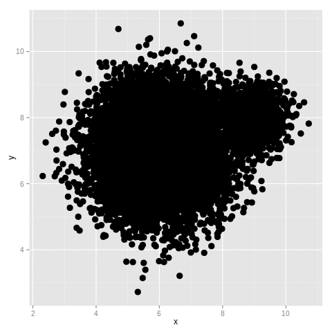

--- .quote bg:#90C695

  <q> ggplot2 Plotting System </q>

--- .normal

## ggplot2
### Intro

  1. `ggplot2` package by Hadley Wickham:

  
  ```r
  install.packages('ggplot2', dep=TRUE)
  ```
  
  ```r
  library(ggplot2)
  ```

  2. Leland Wilkinson's *"Grammar of graphics"* implementation

--- .quote

  <q> "In brief, the grammar tells us that a statistical graphic is **mapping**
  from data to **aesthetic** attributes (colour, shape, size) of **geometric**
  objects (points, lines, bars). The plot may also contain statistical
  transformations of the data and is drawn on a specific coordinate system".
  </q>
  
  *ggplot* book

--- .normal

## ggplot2
### Basic concepts

- Same concept as *base*: **empty canvas**
- Data must be in a **`data.frame`**
- Basic function: `ggplot`
- **IMPORTANT** Factors are better named:  
    + `Control`, `Trat_A` y `Trat_B` instead of `1`, `2` and `3`

--- .normal

## ggplot2
### Basic concepts

- **Main components of a ggplot plot**
  + Data: a data.frame
  + *aesthetics*: How and to where mapping the data
  + *geom*: geometric objects mapped
  + *facets*: conditional panels
  + *stats*: statistical transformations (ablines, histograms...)
  + *scales*: mapping scales (color, sizes, axes)
  + coordinate system
  + *themes*: predefined and custom themes and modifications

--- .normal &twocolvariable w1:55% w2:40%

## gplot2
### Basic concepts

*** =left
- **Layers**
  + First we map the data
  + We add geometries
  + We add visual *helpers* (stats or facets)
  + Finally, metadata and annotations (legends, titles, customization...)

*** =right

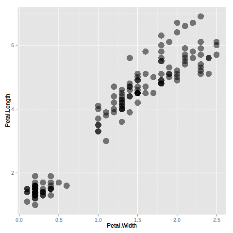

--- .code &twocolvariable w1:55% w2:40%

## gpplot2
### Histogram

*** =left

```r
# Load the library and the data
# install.packages('ggplot2', dep=TRUE)
library(ggplot2)
iris

# Histogram of petal width
histograma <- ggplot(data = iris, aes(x = Petal.Width)) + # first layer
  geom_histogram() # second layer

# Call the plot to see it
histograma
```

*** =right

```
## `stat_bin()` using `bins = 30`. Pick better value with `binwidth`.
```


*** =pnotes


--- .code &twocolvariable w1:55% w2:40%

## ggplot2
### Points

*** =left

```r
# Width-Length relation
puntos <- ggplot(data = iris,
                 aes(x = Petal.Width,
                     y = Petal.Length)) +
  geom_point()

# Call the plot to see it
puntos
```

*** =right


*** =pnotes


--- .code &twocolvariable w1:55% w2:40%

## ggplot2
### Box-plots

*** =left

```r
# Width by Species
cajas_petalo <- ggplot(data = iris,
                       aes(x = Species, y = Petal.Width)) +
  geom_boxplot()

# Call the plot to see it
cajas_petalo
```

*** =right


*** =pnotes


--- .code &twocolvariable w1:55% w2:40%

## ggplot2
### Colors

*** =left

```r
# Build the plot wothout geometry
puntos_petalo <- ggplot(data = iris,
                        aes(x = Petal.Width, y = Petal.Length))

# We add color, the same for all points
puntos_petalo + geom_point(color = 'red', size = 4, alpha = .5)
```

*** =right
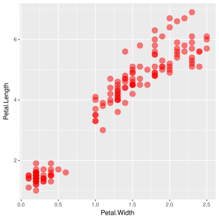

--- .code &threexthree w1:49.5% w2:1% w3:49.5% h1:90% h2:5% h3:5%

## ggplot2
### Colors and shapes


```r
# We map the color to a variable (remember, we do that in the aesthetics)
puntos_petalo + geom_point(aes(color = Species), size = 4, alpha = .5)

# We map the shape to a variable (remember, we do that in the aesthetics)
puntos_petalo + geom_point(aes(shape = Species), size = 4, alpha = .5)
```

*** =left1

*** =right1
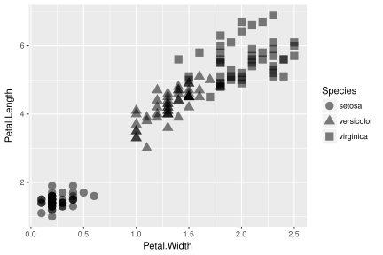

--- .exercise &threexthree w1:33.33% w2:33.33% w3:33.33% h1:90% h2:5% h3:5%

## Exercise 1

Build the plots that we have already seen, but for **sepal** data  

*** =left1
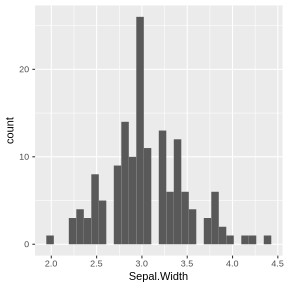
*** =center1

*** =right1
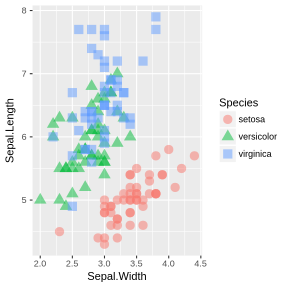
*** =pnotes
**Solution**:

```r
# Build the plots
a <- ggplot(data = iris, aes(x = Sepal.Width)) +
  geom_histogram()
b <- ggplot(data = iris, aes(x = Species,
                           y = Sepal.Width,
                           color = Species)) +
  geom_boxplot()
c <- ggplot(iris, aes(x = Sepal.Width,
                      y = Sepal.Length,
                      color = Species,
                      shape = Species)) +
  geom_point(size = 4, alpha = .5)

# See them
a
b
c
```

--- .code &threexthree w1:40% w2:59% w3:1% h1:90% h2:5% h3:5%

## ggplot2
### Facets and Stats


```r
# Lets save in an object the plot we want
plot_petalo <- ggplot(data=iris, aes(x=Petal.Length, y=Petal.Width, color=Species)) +
  geom_point(size=4, alpha=.5)

# Now we divide it in facets
plot_petalo + facet_grid(. ~ Species)
```

*** =left1
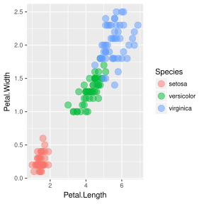
*** =center1


--- .code &threexthree w1:49.5% w2:1% w3:49.5% h1:90% h2:5% h3:5%

## ggplot2
### Facets and Stats

*** =left1

```r
# Si queremos por filas
plot_petalo + facet_grid(Species ~ .)
```

*** =right1
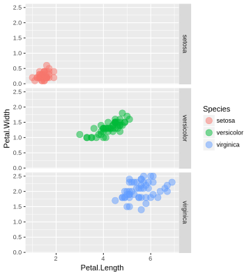

*** =pnotes

```r
iris$Treatment <- rep(c('A', 'B'), 75)
ggplot(data=iris, aes(x=Petal.Length, y=Petal.Width,
                      color=Species, shape = Treatment)) +
  geom_point(size=4, alpha=.5) +
  facet_grid(Treatment ~ Species)
```


--- .code &threexthree w1:49.5% w2:1% w3:49.5% h1:90% h2:5% h3:5%

## ggplot2
### Facets and Stats


```r
# We can add a lineal regression to all the data
plot_petalo + stat_smooth(method='lm')

# or combining stats with facets
plot_petalo + facet_grid(. ~ Species) + stat_smooth(method='lm')
```

*** =left1
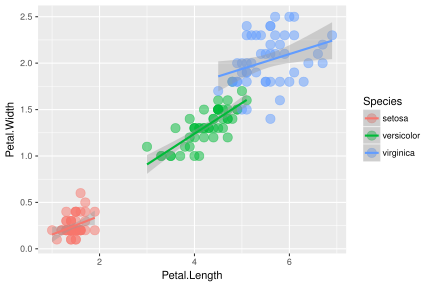
*** =right1
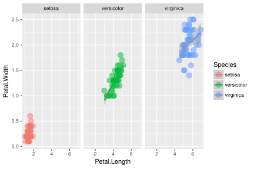

--- .code

## ggplot2
### Facets and Stats


```r
# As we are simply adding layers, we can add another abline calculated
# with all the data. For that we need to "break" the grouping we made with
# the color aesthetic
plot_petalo + stat_smooth(method='lm', se=FALSE) +
  stat_smooth(color='black', method='lm', linetype=2)
```


--- .code &threexthree w1:49.5% w2:1% w3:49.5% h1:90% h2:5% h3:5%

## ggplot2
### Facets and Stats

*** =left1

```r
# There is more stats, like density
ggplot(data=iris, aes(x=Petal.Width)) +
  stat_density(color='red', alpha=.5, fill='red')
```


*** =right1

```r
#
# or quantiles
plot_petalo + stat_quantile()
```

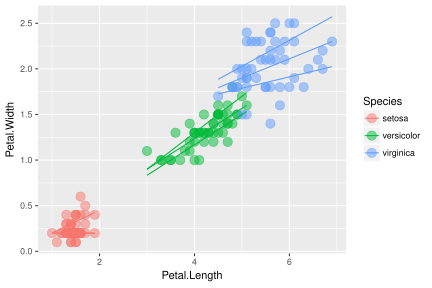

--- .code &threexthree w1:49.5% w2:1% w3:49.5% h1:90% h2:5% h3:5%

## ggplot2
### Scales

*** =left1

```r
#
#
#
# Colour, shape or line type scales
plot_petalo +
  scale_color_manual(values=c('red','green','blue'))
```


*** =right1

```r
# Colour, shape or line type scales
plot_petalo +
  stat_smooth(mapping=aes(linetype=Species),
              method='lm') +
  scale_color_manual(values=c('red','green','blue')) +
  scale_linetype_manual(values=c(1,2,3))
```

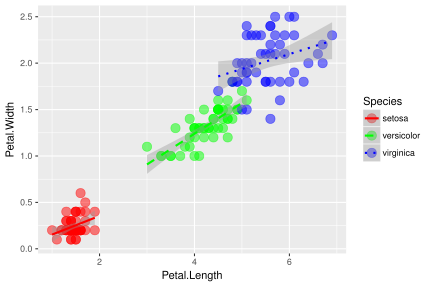

--- .code &threexthree w1:49.5% w2:1% w3:49.5% h1:90% h2:5% h3:5%

## ggplot2
### Scales

*** =left1

```r
#
# Axis scales
plot_petalo +
  scale_x_log10()
```


*** =right1

```r
# Now we can do a loess smooth
plot_petalo +
  scale_x_log10() +
  stat_smooth(method='loess', color='black')
```

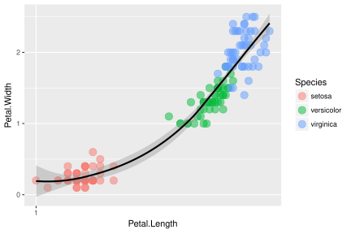

--- .code &threexthree w1:49.5% w2:1% w3:49.5% h1:90% h2:5% h3:5%

## ggplot2
### Annotations

*** =left1

```r
#
# Plot title
plot_petalo +
  labs(title='Width vs. Length (Petal)')
```


*** =right1

```r
# Plot and axis title
plot_petalo +
  labs(title='Width vs. Length (Petal)',
       x='Length [cm]', y='Width [cm]')
```

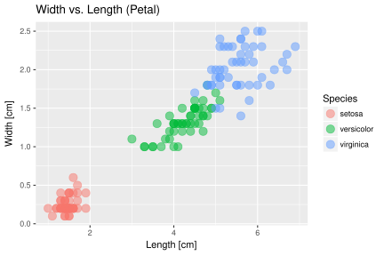


--- .code &threexthree w1:49.5% w2:1% w3:49.5% h1:90% h2:5% h3:5%

## ggplot2
### Personalización

*** =left1

```r
#
#
# Preset themes
plot_petalo +
  theme_bw()
```


*** =right1

```r
# ggthemes library
# install.packages('ggthemes', dep=TRUE)
library(ggthemes)
plot_petalo + theme_solarized(light=FALSE) +
  scale_color_solarized()
```

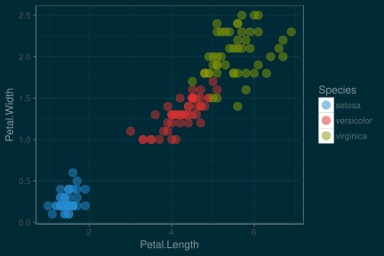

--- .code &threexthree w1:49.5% w2:1% w3:49.5% h1:90% h2:5% h3:5%

## ggplot2
### Customization

*** =left1

```r
# theme customization help
help(theme)

# minimalist config
minimalista <- ggplot(data=iris, aes(x=Petal.Length,
                                     y=Petal.Width,
                                     shape=Species)) +
  geom_point(size=4, alpha=.5)

minimalista + theme_bw() +
  theme(panel.grid=element_blank(),
        panel.border=element_rect(color='black'),
        legend.position=c(.9,.2))
```

*** =right1


--- .code &threexthree w1:55% w2:1% w3:44% h1:90% h2:5% h3:5% bg:#89C4F4

## ggplot2
### Customization

*** =left1

```r
# web modification
web_plot <- ggplot(data=iris, aes(x=Petal.Length,
                                     y=Petal.Width,
                                     colour=Species)) +
  geom_point(size=4, alpha=.9) +
  scale_color_manual(values=c('#4183D7', '#19B5FE', '#22313F'))
  
web_plot + theme_bw() +
  theme(panel.grid=element_blank(),
        panel.border=element_blank(),
        panel.background=element_rect(fill='#C5EFF7'),
        legend.position=c(.9,.2),
        legend.background=element_rect(fill='transparent'),
        legend.key=element_rect(fill='transparent', color='transparent'),
        text=element_text(color='#1F3A93'),
        axis.ticks=element_line(color='#1F3A93'),
        plot.background=element_rect(fill='#89C4F4'))
```

*** =right1
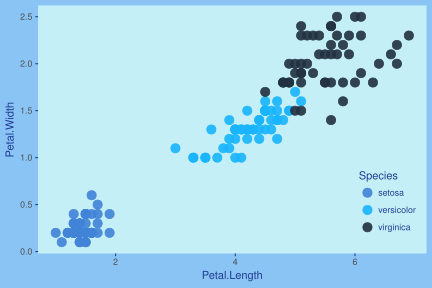

*** =pnotes
To pick up colours, web search is always there for you!!  
You can find things like [flatuicolorpicker](http://www.flatuicolorpicker.com/all)

--- .code &threexthree w1:55% w2:1% w3:44% h1:90% h2:5% h3:5% bg:#89C4F4

## ggplot2
### **Extra** Barplot with error bars

*** =left1

```r
# data preparation with dplyr
library(dplyr)
iris %>%
  group_by(Species, Treatment) %>%
  summarise_all(funs(mean, sd)) %>%
  # building the plot
  ggplot(aes(x=Species, y=Petal.Width_mean, fill = Treatment)) +
  geom_bar(stat='identity', alpha=.7, position = position_dodge()) +
  geom_errorbar(aes(ymin=Petal.Width_mean-Petal.Width_sd,
                    ymax=Petal.Width_mean+Petal.Width_sd,
                    color=Treatment),
                width=0.5,
                position = position_dodge()) +
  scale_color_manual(values=c('#4183D7', '#19B5FE')) +
  scale_fill_manual(values=c('#4183D7', '#19B5FE')) +
  theme_bw() +
  theme(panel.grid=element_blank(),
        panel.border=element_blank(),
        panel.background=element_rect(fill='#C5EFF7'),
        legend.position=c(.12,.8),
        legend.background=element_rect(fill='transparent'),
        legend.key=element_rect(fill='transparent', color='transparent'),
        text=element_text(color='#1F3A93'),
        axis.ticks=element_line(color='#1F3A93'),
        plot.background=element_rect(fill='#89C4F4', color='#89C4F4'))
```

*** =right1
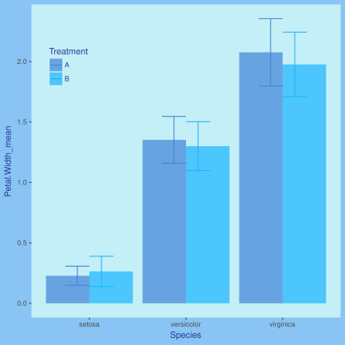

--- .code &threexthree w1:55% w2:1% w3:44% h1:90% h2:5% h3:5% bg:#89C4F4

## ggplot2
### **Extra** Maps

*** =left1

```r
# Data preparation
crimes <- data.frame(state = tolower(rownames(USArrests)),
                     USArrests)

# Map data (from "maps" library)
# install.packages('maps', dep=TRUE)
library(maps)
states_map <- map_data("state")

# Build the plot
mapa <- ggplot(crimes, aes(map_id = state, fill = Murder)) +
  geom_map(map = states_map) +
  expand_limits(x = states_map$long, y = states_map$lat) +
  coord_map()

mapa
```

*** =right1


--- .code

## ggplot2
### **Extra** Interactive maps


```r
# libraries
# install.packages('leaflet')
library(leaflet)
# data
long <- c(2.1093)
lat <- c(41.500821)
que <- c('CREAF')
data <- data.frame(long,lat,que)
# interactive map
leaflet(data) %>%
  addTiles(urlTemplate = 'http://server.arcgisonline.com/ArcGIS/rest/services/World_Imagery/MapServer/tile/{z}/{y}/{x}',
             attribution = 'Tiles &copy; Esri &mdash; Source: Esri, i-cubed, USDA, USGS, AEX, GeoEye, Getmapping, Aerogrid, IGN, IGP, UPR-EGP, and the GIS User Community',
             options = tileOptions(noWrap = FALSE)) %>%
  setView(lng = 2.1093, lat = 41.500821, zoom = 17) %>%
  addCircleMarkers(lng = long, lat = lat,
                   radius = 10,
                   fillOpacity = 0.7,
                   fillColor = "#FDE725",
                   stroke = FALSE) %>%
  addPopups(lng = long, lat = lat, popup = 'CREAF')
```


--- .exercise &threexthree w1:33.33% w2:33.33% w3:33.33% h1:90% h2:5% h3:5% bg:#89C4F4

## Exercise 2

Lets do something different (at least with different data). In the next exercise
we are gonna use the `airquality` data set. This data set describes the ozone
concentration (`Ozone`), solar radiation (`Solar.R`), wind (`Wind`) and
temperature (`Temp`) from May (`5`) to September (`9`), 1973 in New York City.
We want to represent the relation (if any) between ozone concentration and
wind, building a plot with the following elements and layers:

  - Title ('Ozone vs. Wind')
  - Axis titles (x 'Wind [mph]'; y 'Ozone [ppb]')
  - Colour by month
  - Abline foer each month, without the standard error shade
  - Custom scale for color and line type (at your taste)
  - Custom legend to indicate the month name instead of the number

Once we got the previous plot, save it to an object and use it as a starting
point to change the plot background (to 'lemonchiffon') and add facets for
each month

--- .code

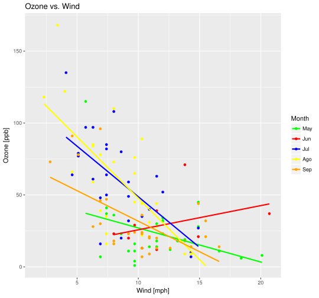

--- .code

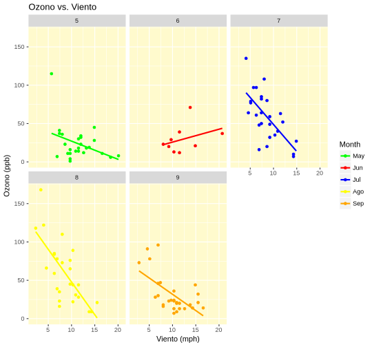

*** =pnotes


```r
airq_plot <- ggplot(airquality,
                    aes(x = Wind, y = Ozone, color = Month)) +
  geom_point() +
  labs(title = 'Ozone vs. Wind', x = 'Wind [mph]', y = 'Ozone [ppb]') +
  geom_smooth(method = 'lm', se = FALSE) +
  scale_color_manual(values = c('green', 'red', 'blue', 'yellow', 'orange'),
                     labels = c('May', 'Jun', 'Jul', 'Ago', 'Sep'))

airq_plot +
  facet_wrap(~ Month) +
  theme(panel.background = element_rect(fill = 'lemonchiffon'))
```

--- {
 tpl: thankyou,
 social: [{title: ResearchGate, href: "https://www.researchgate.net/profile/Victor_Granda2"}, {title: Google Scholar, href: "http://scholar.google.es/citations?user=l5wQUoQAAAAJ"}, {title: e-mail, href: "mailto:victorgrandagarcia@gmail.com"}, {title: twitter, href: "https://twitter.com/MalditoBarbudo"}]
}

## Muchísimas gracias

Para cualquier duda o consulta podeís encontrarme en:

